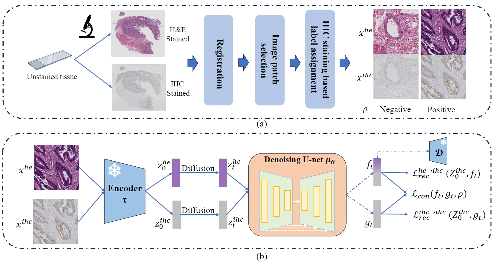

# Multi-modal Denoising Diffusion Pre-training for Whole-Slide Image Classification
This is the official PyTorch implementation of MDDP, a diffusion-based pretraining method for WSI classification.


## Set Up Environment
```
conda env create -f environment.yml
conda activate mddp
pip install torch==1.13.1 torchvision==0.14.1
```

# Running the Code

## pre-training

### Data Pre-process
For diffusion based pre-training, training patches are selected using [Yottixel](https://github.com/KimiaLabMayo/yottixel)-related method:
```
python HE_IHC_select.py
```

### Mddp model training
```
python pretraining/main.py --config configs/pretrain.yaml --train --sample_at_start --save_top --gpu_ids 0
```

## WSI classification
### Feature Extraction
In this step, we extract the Camelyon16 features using the pre-trained mddp model. Firstly, you need to extract patches following the [CLAM](https://github.com/mahmoodlab/CLAM). 
```
python clam/create_patches_fp.py --source DATA_DIRECTORY --save_dir RESULTS_DIRECTORY --patch_size 256 --seg --patch --stitch 
```
Then, modify the 'csv_path', 'data_h5_dir', 'data_slide_dir', 'feat_dir' to your local directories in 'feature_extraction/runners/DiffusionBasedModelRunners/BBDMRunner.py'. The features are extracted using command:
```
python main.py --config configs/Template-LBBDM-f8-CRC.yaml --sample_to_eval --gpu_ids 0 --resume_model MDDP_pretrained/pretrained_weights.pth
```

